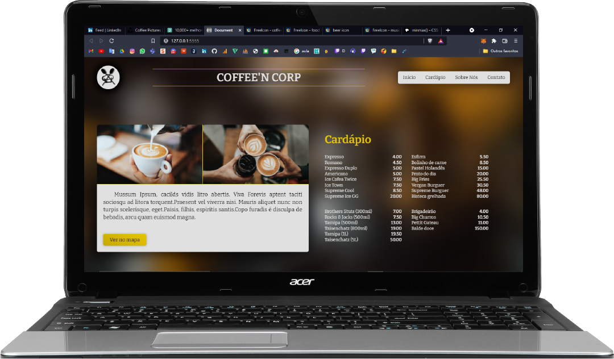

# Really simple Landing Page
I've learned a lot with free content on internet and because of that I decided to start my YouTube channel to help others beginners to get started into the development universe. 

This LP is a pretty higher level html and css project that beacause I introduced subjects like grid and flex displays, transitions, animations and some architecture (with the css @imports). 

So, if you want to learn those features, consider visiting my video where I help you to code this nice project: https://github.com/AngeloSchulerPiletti/coffee_in_corp-landing_page.git

### Tip
Try do don't git clone it before coding from the video.

### Utilities
All images are free and I got them from: https://unsplash.com/

All icons are free and I got them from: https://freeicons.io/

 

## Preview
